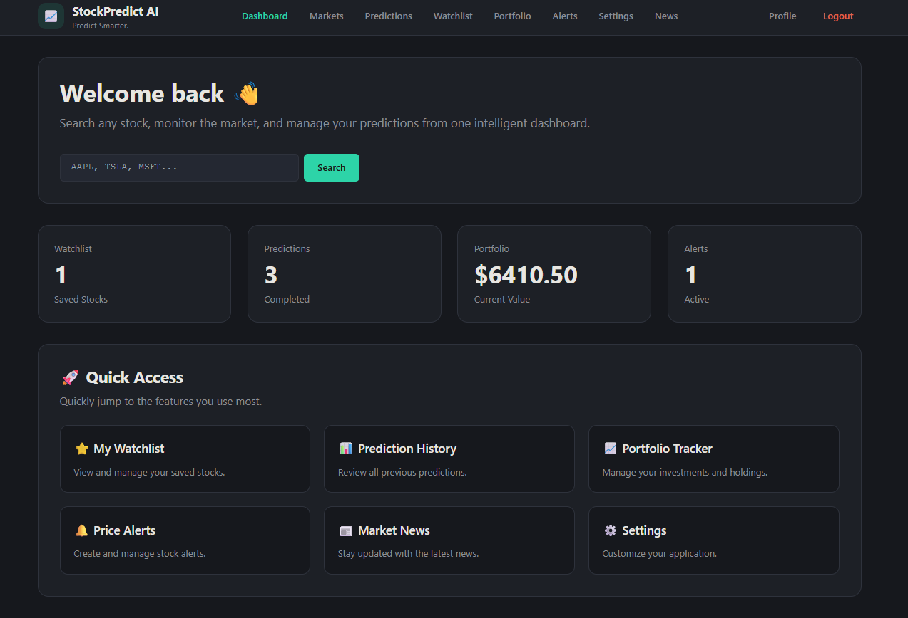

# 📈 StockPredict AI

**AI-powered stock market prediction and analytics platform.**

Predict future stock prices using Machine Learning and Deep Learning models, analyze live market data, technical indicators, and financial news sentiment — all from one intelligent dashboard.

🔗 **Live Demo:** [stock-predicator.vercel.app](https://stock-predicator.vercel.app/)


<!-- Replace the above with an actual screenshot of your dashboard. Save it to /docs/screenshot.png -->

---

## ✨ Features

- **📈 Real-Time Market Data** — Live stock prices and historical trends
- **🤖 AI Stock Prediction** — Forecasts powered by Machine Learning and Deep Learning models
- **📊 Technical Indicators** — RSI, EMA, SMA, MACD, Bollinger Bands, and more
- **📰 News Sentiment Analysis** — NLP-based analysis of financial news to gauge market sentiment
- **Dashboards for** Markets, Predictions, Watchlist, Portfolio, Alerts, and News

## 🧠 Machine Learning Models

| Category | Model | Purpose |
|---|---|---|
| Traditional ML | **Random Forest** | Ensemble learning across multiple decision trees for accurate, low-overfit predictions |
| Deep Learning | **LSTM** | Captures long-term dependencies in stock price sequences for time-series forecasting |
| Technical Analysis | **RSI / EMA / SMA / MACD / Bollinger Bands** | Classic indicators for trend and momentum analysis |
| NLP | **News Sentiment** | Analyzes financial news to estimate market sentiment |

## 🛠️ Tech Stack

**Frontend:** Next.js (TypeScript, App Router, Tailwind CSS)
**Backend:** FastAPI (Python), Pydantic
**Deployment:** Vercel (frontend), Render (backend) — see `render.yaml`
**Containerization:** Docker Compose

## 🚀 Getting Started

### Backend

```bash
cd backend
python -m venv venv
source venv/bin/activate        # Windows: venv\Scripts\activate
pip install fastapi "uvicorn[standard]" pydantic pydantic-settings python-dotenv
uvicorn app.main:app --reload --port 8000
```

Visit `http://localhost:8000/health` and `http://localhost:8000/docs`

### Frontend

```bash
cd frontend
npm install
npm run dev
```

Visit `http://localhost:3000`

## 📌 Roadmap

- [ ] Database models
- [ ] Full API endpoints beyond `/health`
- [ ] Authentication
- [ ] Dockerized local Postgres/Redis for development

## 👤 Author

**Arsh Srivastava**

---

⭐ If you find this project interesting, consider giving it a star!
